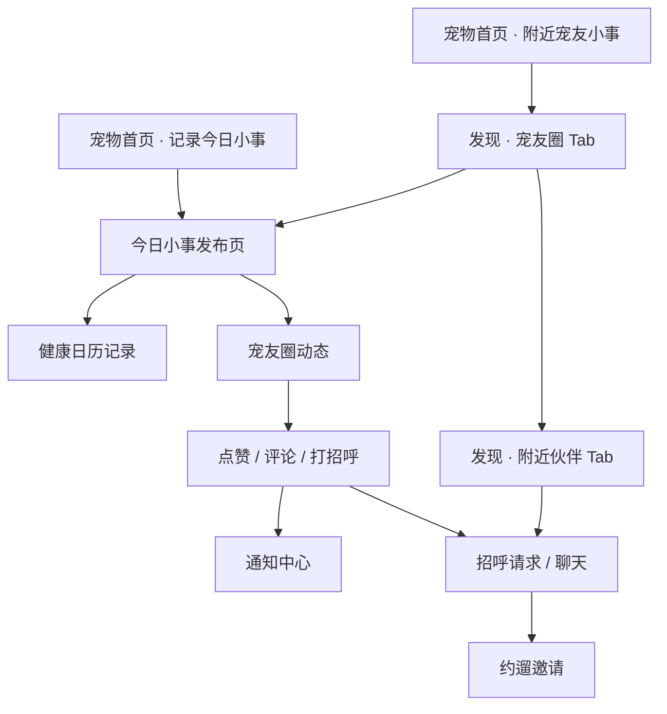

# Lumii 宠友圈产品设计方案 - 2026-06-19

## 1. 设计目标

宠友圈要像“宠物版朋友圈”，但不能照搬微信朋友圈的社交压力。Lumii 的核心还是宠物陪伴和附近破冰，所以设计目标是：

- 以宠物为主角，而不是以人设为主角。
- 内容轻、温暖、生活化，降低发布门槛。
- 浏览时先看宠物小事，再自然进入打招呼、聊天、约遛。
- 复用现有「今日小事」发布页，避免重新设计一套发布器。
- 复用现有发现页附近伙伴逻辑，避免把附近社交拆散。

## 2. 聚合关系

宠友圈不是凭空新增一个孤立模块，而是把现有内容聚合起来。



### 已有内容如何聚合

| 现有内容 | 聚合到宠友圈后的角色 |
| --- | --- |
| 宠物首页「附近宠友小事」 | 首页摘要卡，点击进入宠友圈 |
| 今日小事发布页 | 宠友圈发布器 |
| 健康日历 | 保存自己的记录，不等于公开动态 |
| 发现页附近伙伴 | 宠友圈的第二个 Tab |
| 打招呼 Bottom Sheet/逻辑 | 动态卡片上的破冰动作 |
| 消息/招呼请求 | 宠友圈互动后的会话承接 |
| 通知中心 | 点赞、评论、打招呼提醒 |
| 我的页附近可见/模糊定位 | 宠友圈曝光与距离展示规则 |

## 3. 总体信息架构

推荐把现有底部导航「发现」升级为社交聚合页。

```txt
发现
  ├─ 宠友圈
  │   ├─ 顶部位置/隐私状态
  │   ├─ 发布入口：记录小事
  │   ├─ 附近小事动态流
  │   ├─ 点赞 / 评论 / 打招呼
  │   └─ 空态 / 定位态 / 错误态
  └─ 附近伙伴
      ├─ 现有附近主人列表
      ├─ 搜索
      ├─ 筛选
      ├─ 打招呼
      └─ 约遛
```

不建议新增底部导航项「宠友圈」，因为当前底部已经有：首页、AI、地图、消息、我的。如果再加一个，MVP 会显得拥挤，而且“发现”和“宠友圈”语义容易重叠。

## 4. 视觉原则

基于现有 Lumii Opus4.7 风格：

- 背景：暖米色 `#FBF7F1`。
- 主操作：暖橙 `#FF8A5C`。
- 成功/距离/在线：青绿色 `#4DB6AC`。
- 卡片：白底或极浅暖白，14-20px 圆角，轻描边，少阴影。
- 图片：真实卡通化宠物图，圆角 14-18px。
- 标签：小 pill，橙色表达情绪/宠物状态，青绿色表达距离/健康/可互动。
- 字体：中文主文案克制，不写营销口号。
- 页面不做大 hero，宠友圈是内容流，不是宣传页。

## 5. 页面 1：发现聚合页

中文名：`发现-宠友圈与附近伙伴`

### 5.1 页面结构

```txt
顶部区域
  - 标题：发现
  - 右侧：搜索图标、筛选图标、发布小事图标

分段 Tab
  - 宠友圈
  - 附近伙伴

宠友圈 Tab
  - 位置/隐私提示条
  - 记录小事入口卡
  - 动态流列表

附近伙伴 Tab
  - 沿用当前发现页列表
```

### 5.2 顶部区域

建议：

- 标题仍叫「发现」，不直接叫「宠友圈」，保持底部导航一致。
- 分段 Tab 让用户知道这里同时包含动态和附近伙伴。
- 发布入口用图标按钮或小胶囊「记录小事」，不要做大面积 hero。

顶部文案：

- 主标题：`发现`
- 定位状态：`附近 10km · 模糊距离`（半径随后台 `3/5/10km` 配置变化）
- 隐私提示：`只展示大致范围`

### 5.3 Tab 行

样式：

- 白底圆角分段控件。
- 选中态浅橙底 + 橙色文字。
- 未选中为灰色文字。

Tab：

- `宠友圈`
- `附近伙伴`

默认选中：`宠友圈`。

### 5.4 发布入口卡

设计目的：

- 提醒用户可以发布。
- 不抢动态列表主视觉。

结构：

```txt
左侧：当前宠物头像 / 小 paw 图标
标题：记录今天的小事
副文案：让附近宠友认识 TA
右侧：橙色小按钮「发布」
```

点击后进入现有「今日小事」发布页。

### 5.5 动态流布局

每条动态为独立卡片。

```txt
卡片顶部
  - 宠物头像
  - 宠物名
  - 主人昵称
  - 模糊距离
  - 发布时间

正文
  - 最多 4 行
  - 超出显示「展开」

图片区域
  - 1 张：大图 16:10
  - 2 张：左右两张
  - 3 张：一大两小或三宫格

标签行
  - 心情标签
  - 物种/品种标签

互动栏
  - 点赞
  - 评论
  - 打招呼
```

### 5.6 动态卡片建议尺寸

- 卡片外边距：左右 16。
- 卡片圆角：18。
- 卡片 padding：14-16。
- 宠物头像：48。
- 正文字号：14.5-15。
- 元信息字号：11-12。
- 图片圆角：14。
- 互动栏高度：36-40。

## 6. 页面 2：宠友圈动态卡片

中文名：`宠友圈-动态卡片组件`

### 6.1 卡片默认态

示例内容：

```txt
Lucky · Serena
约 1km · 12 分钟前

今天 Lucky 第一次主动叼球来找我，像是在说“快陪我玩！”

[图片]

开心  金毛  可约遛

♡ 12   💬 3   打招呼
```

设计重点：

- 宠物名比主人昵称更突出。
- 距离必须模糊。
- 打招呼是社交转化主按钮，但不能过重，避免压过内容。

### 6.2 点赞态

变化：

- 心形变橙色填充。
- 数字立即 +1。
- 失败时回滚，并显示顶部 surface Toast：`点赞失败，请稍后再试`。

### 6.3 评论摘要态

如果有评论，卡片底部显示最多 2 条评论摘要：

```txt
安安：它这个眼神也太快乐了
小北：我们家奶油也超爱叼球
```

点击评论区打开评论 Bottom Sheet。

MVP 可先只显示评论数量，不展示摘要；如果要更像朋友圈，建议 Phase 2.5 加摘要。

### 6.4 已删除/不可见态

如果动态被删除或对方关闭附近可见：

- 从列表移除。
- 如果用户正在详情/评论弹层，显示轻提示：`这条小事已不可见`，并关闭弹层或返回列表。

## 7. 页面 3：发布今日小事

中文名：`今日小事-宠友圈发布增强`

### 7.1 复用原则

当前「今日小事」页继续作为发布页，不新开一个完全不同的“发朋友圈”页面。

保留：

- 宠物 chip。
- 正文输入。
- 照片 3 格。
- 心情标签。
- AI 帮我写。
- 底部发布胶囊按钮。

新增：

- 可见范围控件。
- 是否同步健康日历的产品口径。

### 7.2 可见范围控件

推荐放在照片区下面、心情标签上面，或发布按钮上方。

结构：

```txt
可见范围
  ○ 附近宠友可见
    只展示模糊距离，不展示精确位置
  ○ 仅自己可见
    保存到健康日历，不进入宠友圈
```

默认建议：

- MVP 测试期：默认 `附近宠友可见`，让双手机测试链路更顺。
- 正式上线可评估是否改成默认 `仅自己可见`，降低隐私压力。

### 7.3 发布后流向

来源不同，发布成功后返回不同地方：

| 来源 | 发布成功后 |
| --- | --- |
| 首页「记录今日小事」 | 回首页，首页附近小事模块刷新 |
| 宠友圈发布入口 | 回宠友圈，自己的动态进入列表顶部 |
| 健康日历入口 | 回健康日历 |

注意：

- 当前首页「附近宠友小事」不展示自己的小事，这个规则仍保留。
- 宠友圈完整列表可以展示自己的动态，并提供删除入口。

## 8. 页面 4：评论 Bottom Sheet

中文名：`宠友圈-动态评论弹层`

### 8.1 结构

```txt
Bottom Sheet
  - handle
  - 标题：评论
  - 动态摘要
  - 评论列表
  - 底部输入栏
```

### 8.2 动态摘要

展示：

- 宠物头像。
- 宠物名。
- 正文两行。
- 图片缩略图可选。

### 8.3 评论列表

每条评论：

```txt
头像
昵称 · 时间
评论内容
```

自己的评论右侧可显示删除图标或长按删除。

### 8.4 输入栏

placeholder：

`和宠友聊聊这件小事`

发送按钮：

- 有内容：橙色。
- 空内容：灰色禁用。
- 发送中：小 loading。

### 8.5 空态

文案：

`还没有评论，来做第一个回应的人吧`

## 9. 页面 5：轻量资料卡

中文名：`宠友圈-宠友资料轻卡`

用途：

- 从动态头像/昵称进入。
- 不做完整个人主页，先复用附近主人卡信息。

结构：

```txt
Bottom Sheet
  - 宠物头像
  - 宠物名 / 品种 / 年龄
  - 主人昵称
  - 模糊距离
  - 标签：想交朋友、可约遛、猫/狗
  - 按钮：打招呼、发消息/继续聊天、约遛
```

MVP 如果赶进度，可以先不做此卡：

- 点击头像直接进入现有发现页附近伙伴 Tab，并定位/高亮该用户。

## 10. 页面 6：通知回流

中文名：`通知中心-宠友圈互动`

### 10.1 通知类型

- 点赞通知：`安安赞了 Lucky 的小事`
- 评论通知：`小北评论了 Lucky 的小事`
- 打招呼通知：沿用现有招呼请求。

### 10.2 点击行为

MVP 建议：

- 有动态详情/评论弹层时：打开该动态。
- 没有详情页时：进入宠友圈 Tab，并刷新列表。

### 10.3 消息已读

- 点赞/评论通知进入通知中心。
- 普通聊天消息仍进入会话，不要混入招呼请求。
- 这条原则延续此前修过的通知分类问题。

## 11. 状态设计

### 11.1 加载中

样式：

- 使用现有 SkeletonCard。
- 宠物头像圆形骨架。
- 正文 2-3 行骨架。
- 图片区域骨架。

文案可不显示，避免页面啰嗦。

### 11.2 有动态

展示动态流。

顶部可显示轻提示：

`附近 10km · 只展示模糊距离`（半径随后台配置变化）

### 11.3 附近有伙伴但暂无小事

结构：

- 3 个附近伙伴头像栈。
- 标题：`附近伙伴还没分享小事`
- 副文案：`先去打个招呼，或者记录你家毛孩子今天的小事`
- CTA：`记录小事`
- 次级：`看附近伙伴`

### 11.4 附近无伙伴/暂无小事

结构：

- 温暖 paw 插画或小宠物头像。
- 标题：`附近暂时还没有小事`
- 副文案：`稍后再来看看`
- CTA：`刷新附近`

### 11.5 定位未授权

结构：

- 使用现有发现页定位未授权风格。
- 标题：`开启定位，看看附近宠友的小事`
- 副文案：`灵伴只展示模糊距离，不会公开你的精确位置`
- CTA：`开启定位`
- 次级：`暂不开启`

### 11.6 附近可见关闭

结构：

- 标题：`附近可见已关闭`
- 副文案：`开启后才能看到附近宠友，也能让别人看到你的宠物小事`
- CTA：`去设置开启`
- 次级：`仅记录自己的小事`

### 11.7 网络失败

结构：

- 标题：`宠友圈加载失败`
- 副文案：`网络有点不稳定，稍后再试试`
- CTA：`重新加载`

## 12. 交互细节

### 12.1 下拉刷新

- 宠友圈 Tab 下拉刷新动态。
- 附近伙伴 Tab 下拉刷新伙伴列表。
- 两个 Tab 共用当前位置，但请求状态独立。

### 12.2 分页

- 列表触底加载下一页。
- 底部显示小 loading。
- 没有更多时显示轻文案：`附近的小事先看到这里`

### 12.3 点赞

- 乐观更新。
- 失败回滚。
- 连点节流。

### 12.4 评论

- 发送中禁用重复发送。
- 失败保留输入。
- 删除评论需要二次确认或长按菜单。

### 12.5 打招呼

- 若未有会话：进入现有招呼请求链路。
- 若已有会话：直接进入聊天。
- 若对方已不可见：toast `对方暂时不可见，请刷新宠友圈`。

## 13. 数据与接口聚合

### 13.1 当前接口

当前已能支撑首页摘要：

- `GET /social/nearby-moments`
- `POST /social/moments`

### 13.2 宠友圈正式接口

需要从 `nearby-moments` 演进到分页动态流：

```txt
GET /social/pet-circle/posts
POST /social/pet-circle/posts
POST /social/pet-circle/posts/{postId}/like
DELETE /social/pet-circle/posts/{postId}/like
GET /social/pet-circle/posts/{postId}/comments
POST /social/pet-circle/posts/{postId}/comments
DELETE /social/pet-circle/comments/{commentId}
DELETE /social/pet-circle/posts/{postId}
```

### 13.3 媒体

今日小事图片当前只有本地预览和照片数量。

宠友圈需要真实图片跨设备可见，因此需要接入 COS：

- 发布前上传图片到 COS。
- 后端保存 `mediaIds`。
- 动态流返回可展示的代理 URL。

MVP 可先支持 0-3 张图。

## 14. 和首页摘要卡的关系

首页「附近宠友小事」仍保留。

逻辑：

- 有附近动态：轮播附近其他用户的小事。
- 附近有伙伴无动态：静态伙伴态。
- 附近无伙伴：静态空态。
- 加载失败：错误态。

点击行为：

- 有动态：进入宠友圈 Tab，可定位到该动态或进入动态详情。
- 无动态但有伙伴：进入附近伙伴 Tab。
- 空态：刷新附近或进入宠友圈空态。

## 15. Figma Make 设计产出清单

你后续在 Figma Make 里建议按以下顺序生成：

1. `发现-宠友圈与附近伙伴`
2. `宠友圈-动态评论弹层`
3. `宠友圈-状态合集`
4. `今日小事-可见范围控件`
5. `宠友圈-宠友资料轻卡`，可选
6. `通知中心-宠友圈互动通知`，可选

优先级：

- P0：1、2、3、4。
- P1：5、6。

## 16. 设计提示词

### 16.1 发现-宠友圈与附近伙伴

```txt
为 Lumii 灵伴 App 设计一个移动端「发现」页面，整体风格延续现有 Lumii Opus4.7：暖米色背景、真实卡通化宠物头像、柔和圆角卡片、橙色与青绿色点缀、中文界面。页面顶部标题为「发现」，下方是分段 Tab：「宠友圈」「附近伙伴」。默认选中「宠友圈」。宠友圈内容为附近宠友发布的宠物小事动态流，顶部有一个轻量发布入口「记录小事」。每条动态卡片包含宠物头像、宠物名、主人昵称、模糊距离、发布时间、正文、1-3 张圆角图片、心情标签，以及点赞、评论、打招呼三个操作。附近伙伴 Tab 保留现有附近宠物主人列表风格。底部仍保留现有 App TabBar。不要做营销页，不要英文，不要使用夸张渐变背景。
```

### 16.2 宠友圈-动态评论弹层

```txt
为 Lumii 灵伴 App 设计一个「宠友圈动态评论 Bottom Sheet」。风格延续 Lumii Opus4.7，中文界面。弹层从底部上拉，顶部有拖拽 handle 和标题「评论」。上方展示动态摘要：宠物头像、宠物名、小事正文两行。中间为评论列表，每条评论包含用户头像、昵称、评论内容、时间。底部固定输入栏，placeholder 为「和宠友聊聊这件小事」，右侧为橙色发送按钮。包含空评论状态「还没有评论，来做第一个回应的人吧」。整体精致、留白协调，不要新增页面导航栏。
```

### 16.3 宠友圈-状态合集

```txt
为 Lumii 灵伴 App 设计「宠友圈状态合集」移动端页面/组件，中文界面，风格延续 Lumii Opus4.7。需要 5 个状态：1 附近暂无小事，2 附近有伙伴但暂无小事，3 定位未授权，4 附近可见已关闭，5 网络加载失败。每个状态都在宠友圈页面内展示，不是独立错误页。使用温暖宠物插画/头像栈、柔和卡片、明确主按钮，例如「刷新附近」「开启定位」「去记录小事」「去设置开启」。保持底部 TabBar 和页面 Tab 不变。
```

### 16.4 今日小事-可见范围控件

```txt
基于 Lumii 灵伴现有「今日小事」发布页，新增一个「可见范围」选择控件，不重做整个页面。控件放在正文和照片区域下方或发布按钮上方，样式为柔和白色圆角卡片。标题「可见范围」，两个选项：「附近宠友可见」「仅自己可见」。默认选中附近宠友可见，选中态使用 Lumii 橙色描边和浅橙底。附一行小字说明「附近宠友只会看到模糊距离，不展示精确位置」。中文界面，风格必须与现有页面一致。
```

## 17. 当前我建议的开发顺序

在你确认设计方向后，开发顺序建议：

1. 先扩展后端数据模型：post、like、comment、visibility、mediaIds。
2. 发布页增加可见范围，不改整页。
3. 发现页加双 Tab，先让宠友圈列表能显示真实动态。
4. 点赞和通知。
5. 评论 Bottom Sheet。
6. 从动态打招呼/进入聊天。
7. 删除动态和隐私联动。

其中第 2 步可以在现有页面轻改；第 3、5 步必须等 Figma Make 页面。

## 18. 待你确认

1. 「发现」是否默认进入宠友圈，而不是附近伙伴？
2. 发布小事默认是否附近宠友可见？
3. 宠友圈是否展示主人头像，还是只展示宠物头像？
4. MVP 第一版是否要评论，还是先做点赞 + 打招呼？
5. 删除宠友圈动态时，是否保留健康日历记录？
6. 首页「附近宠友小事」点击有动态时，是进入宠友圈列表，还是直接打开评论弹层/详情？
